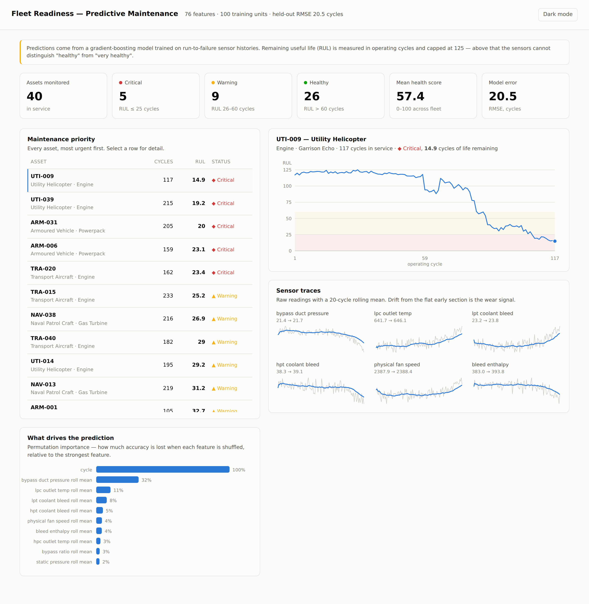

# Predictive Maintenance for Military Equipment

Predict **how many operating cycles a piece of equipment has left before it fails**,
and show the whole fleet ranked by urgency so maintenance gets scheduled before
something breaks instead of after.

Built for problem statement **PS9 — Predictive Maintenance for Military Equipment**.



---

## The problem

Military equipment is maintained on a fixed schedule — every N hours, service the
engine. That is wasteful in both directions. Parts get replaced while they still
have life left, and parts fail anyway between service intervals, which for a
transport aircraft or a forward-base generator is a readiness problem, not just a
cost problem.

Condition-based maintenance replaces the calendar with the equipment's own sensor
data. This project does that end to end: it learns degradation patterns from
run-to-failure histories, predicts **Remaining Useful Life (RUL)** for equipment
currently in service, and presents it as a dashboard an operator can act on.

## About the data

Real military telemetry is classified and not publicly available. This project uses
**NASA's C-MAPSS turbofan degradation dataset** — the standard public benchmark for
exactly this task — and labels the units as military assets in the interface.

The repo ships with a **synthetic generator** that produces data in the identical
format, so the project runs immediately without any download. The degradation model
behind it is physics-inspired: units stay near-healthy for the first 35–60% of life,
then deteriorate at an accelerating rate, with per-unit manufacturing variation and
per-reading sensor noise on top.

To swap in the real NASA data, run `python scripts/download_data.py` and retrain. No
code changes — the file format matches.

## Results

| Metric | Cross-validation | Held-out test units |
|---|---|---|
| RMSE (cycles) | 18.4 | 20.5 |
| MAE (cycles) | 12.3 | 15.1 |
| R² | 0.81 | 0.63 |

Roughly: predictions land within about 15 cycles of the true remaining life. For
context, published results on the real C-MAPSS FD001 benchmark cluster in the 13–20
RMSE range, so this is in a reasonable band — though the numbers above are on
synthetic data and are not directly comparable.

Cross-validation is **grouped by unit**. This matters: consecutive cycles from one
engine are nearly identical, so a random row split would put near-duplicate rows in
both train and validation and produce a score that looks excellent and means
nothing.

### One bug worth documenting

An early version scored RMSE 1.8 — suspiciously perfect. The cause was a feature
computed as `cycle / max(cycle)` for each unit. In training data a unit's last cycle
*is* its failure cycle, so that feature handed the model the answer it was supposed
to predict. It was removed; see the comment in `backend/data.py`. Leakage like this
is the single most common way a prognostics model looks great in a notebook and
fails in the field.

## How it works

**1. Features.** A single sensor reading says little — absolute values differ between
units because of manufacturing variation. What signals wear is *change over time*, so
each sensor contributes four features: a 20-cycle rolling mean (smooths noise), a
rolling standard deviation (volatility rises with wear), drift from the unit's own
healthy baseline, and short-term slope. Four constant sensors carry no information
and are dropped. 76 features total.

**2. Model.** `HistGradientBoostingRegressor` — gradient-boosted trees. Chosen over a
neural network deliberately: the dataset is small, trees handle mixed feature scales
without normalisation, training takes seconds on a laptop, and results are
reproducible. An LSTM is the natural next step for sequence modelling.

**3. Target capped at 125 cycles.** Beyond that, sensors genuinely cannot distinguish
"healthy" from "very healthy" — letting the model chase the difference between 300
and 280 cycles-to-failure wastes capacity on a distinction nobody acts on.

**4. Serving.** FastAPI scores every in-service unit and exposes fleet-level and
per-asset endpoints. The dashboard is plain HTML, CSS and JavaScript with hand-drawn
SVG charts — no build step, no npm, no CDN. Clone and run.

## Quick start

Requires Python 3.10 or newer.

```bash
git clone https://github.com/YOUR-USERNAME/predictive-maintenance.git
cd predictive-maintenance

python -m venv .venv
source .venv/bin/activate          # Windows: .venv\Scripts\activate
pip install -r requirements.txt

python scripts/generate_data.py    # create the dataset
python -m backend.train            # train the model (~30 seconds)
uvicorn backend.api:app --reload   # start the server
```

Open **http://localhost:8000**.

## API

Interactive documentation is generated automatically at http://localhost:8000/docs.

| Endpoint | Returns |
|---|---|
| `GET /api/health` | Service status and whether a model is loaded |
| `GET /api/fleet` | All assets with risk scores, sorted most urgent first |
| `GET /api/asset/{unit}` | RUL trajectory and sensor traces for one asset |
| `GET /api/importance` | Which features drive the predictions |
| `GET /api/metrics` | Evaluation metrics from the last training run |

## Project layout

```
backend/
  data.py       loading, labelling, feature engineering
  train.py      training, evaluation, model persistence
  api.py        FastAPI service
frontend/
  index.html    dashboard (single file, no build step)
scripts/
  generate_data.py   synthetic run-to-failure data
  download_data.py   fetch the real NASA C-MAPSS dataset
tests/
  test_pipeline.py   correctness checks, including a leakage guard
models/         saved model and metrics (created by training)
data/           datasets (not committed)
```

## Tests

```bash
pip install pytest
pytest -q
```

The suite covers label correctness, the absence of future information in features,
and API response shape.

## What I'd add next

- **Sequence model (LSTM/GRU)** to use the full sensor history rather than
  window-summary features
- **Prediction intervals** — an operator needs "40 ± 12 cycles", not a bare point
  estimate
- **Anomaly detection** for sudden faults, which are a different failure mode from
  gradual wear and which an RUL model will miss
- **Work-order generation** — turn a critical prediction into an assigned task with
  the right spare parts

## Licence

MIT — see [LICENSE](LICENSE).

## Acknowledgements

Data format and problem framing follow NASA's C-MAPSS turbofan degradation dataset
(Saxena, A., Goebel, K., Simon, D., & Eklund, N., *Damage Propagation Modeling for
Aircraft Engine Run-to-Failure Simulation*, PHM 2008).
